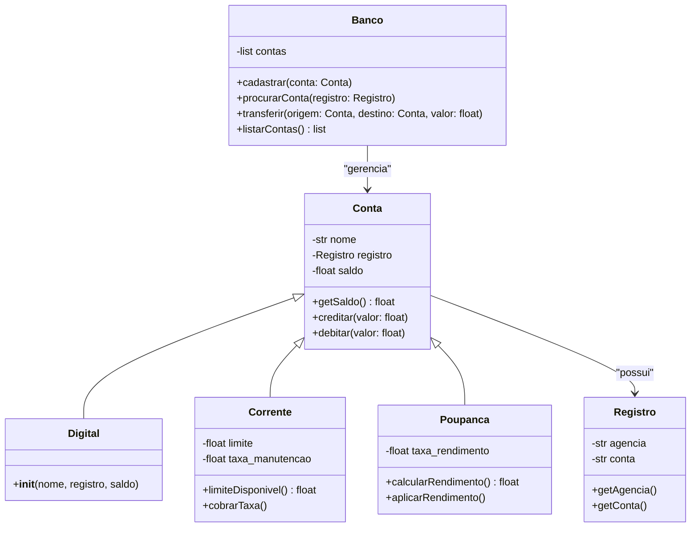

# 🧩 Programação Orientada a Objetos — Conjunto de Atividades

Este repositório reúne diversas atividades desenvolvidas ao longo da disciplina de **Programação Orientada a Objetos (POO)** em Python.  
Cada atividade explora um conceito específico, incluindo **classes**, **herança**, **composição**, **modularização**, **menus interativos** e **estruturas de dados**.

A seguir, estão listadas todas as atividades incluídas neste repositório.

---

# 📘 Atividade 1 — Tipo de Triângulo

Recebe as coordenadas de três pontos e determina:

- Se formam um triângulo
- Tipo: **Equilátero**, **Isósceles** ou **Escaleno**

---

# 🟪 Atividade 2 — Identificação de Quadriláteros

Recebe quatro pontos no plano e identifica se o quadrilátero formado é:

- Quadrado  
- Retângulo  
- Losango  
- Paralelogramo  
- Trapézio  
- Quadrilátero qualquer

---

# 📝 Atividade 3 — Menu Interativo (Triângulo / Quadrilátero)

Menu simples que permite ao usuário escolher:

- Identificar tipo de triângulo
- Identificar tipo de quadrilátero

---

# 🍔 Atividade 4 — Sistema de Estoque da Cantina (15/10/2025)

Sistema modular de gerenciamento de estoque, incluindo:

- Cadastro de produtos (comida/bebida)
- Atualização de informações
- Reposição automática
- Relatórios gerados em arquivo `.txt`
- Estrutura orientada a objetos com classes separadas por responsabilidade

---

# 🏦 Atividade 5 — Sistema Bancário Completo (27/10/2025)

Sistema bancário orientado a objetos com:

### ✔️ Classes
- **Registro**
- **Conta** (classe base)
- **Conta Corrente**
- **Conta Poupança**
- **Conta Digital**
- **Banco**

### ✔️ Funcionalidades
- Cadastro de contas
- Depósito, saque, transferência
- Aplicação de rendimentos (poupança)
- Cobrança de taxa (corrente)
- Listagem geral de contas

### ✔️ Diagrama de Classes (Mermaid)



---

# 🏫 Atividade 6 — Sistema de Campus e Cursos (CRUD Completo)

Sistema acadêmico inspirado na estrutura da **UFC**, utilizando classes e listas para armazenar dados em memória.  
A lógica é semelhante à usada no projeto “BancoLista”, mas aplicada ao contexto educacional.

## 🧱 Estrutura das Classes

### 📍 Classe `Universidade`
Gerencia múltiplos campus.

- adicionar_campus()
- listar_campi()
- atualizar_campus()
- remover_campus()

### 🏫 Classe `Campus`
Cada campus possui vários cursos.

- adicionar_curso()
- listar_cursos()
- atualizar_curso()
- remover_curso()

### 📘 Classe `Curso`
Objeto simples representando um curso.

- `codigo`
- `nome`

---

## 🖥️ Menu Interativo

O sistema possui dois menus:

### Menu da Universidade
- Criar campus  
- Listar campus cadastrados  
- Atualizar campus  
- Remover campus  

### Menu de Cursos (por campus)
- Criar curso  
- Listar cursos  
- Atualizar curso  
- Remover curso  

---

## ▶️ Como Executar

**Windows**
```
py main.py
```

**Linux/macOS**
```
python3 main.py
```

---

# 📌 Observações Gerais

- Todos os projetos são independentes, mas seguem o mesmo padrão de modularização.
- Nenhum sistema utiliza banco de dados — os dados são mantidos apenas em memória.
- Os exercícios foram construídos para fins didáticos, praticando conceitos centrais de POO.

---

# 👤 Autor da Atividade
Trabalhos realizados individualmente com permissão para colaboração entre colegas — disciplina de **Programação Orientada a Objetos**.

